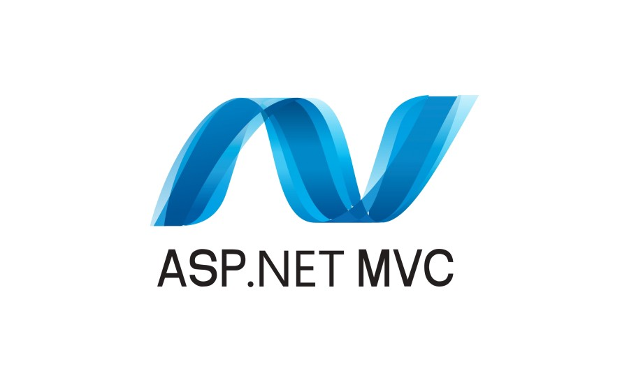
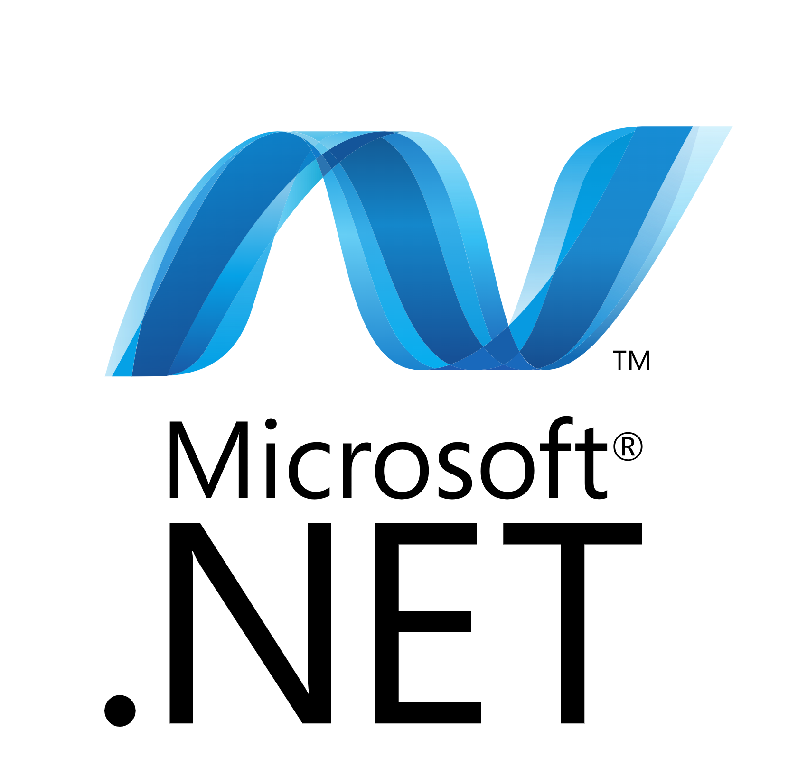
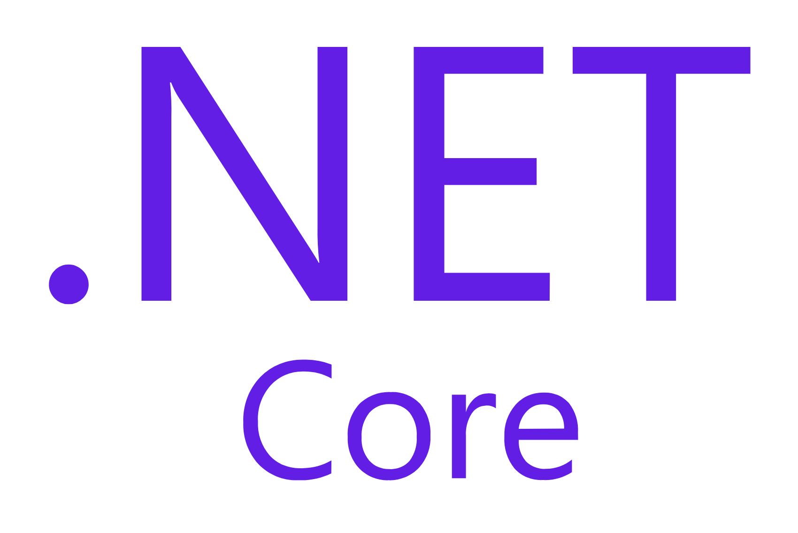
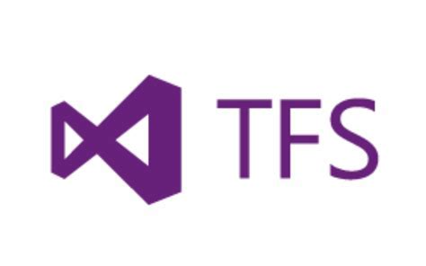
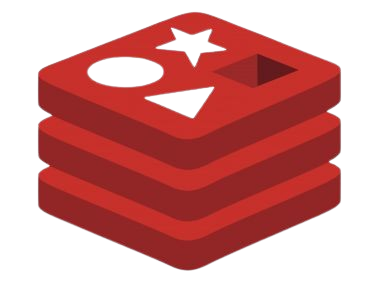
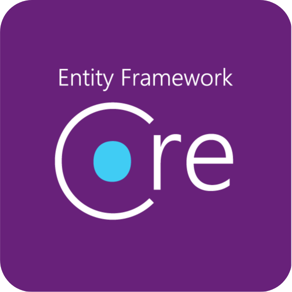
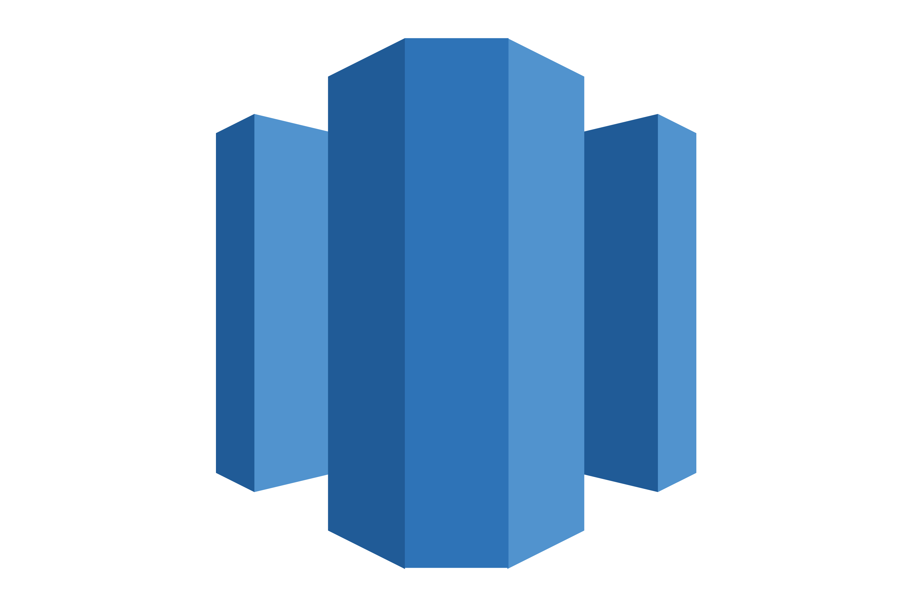
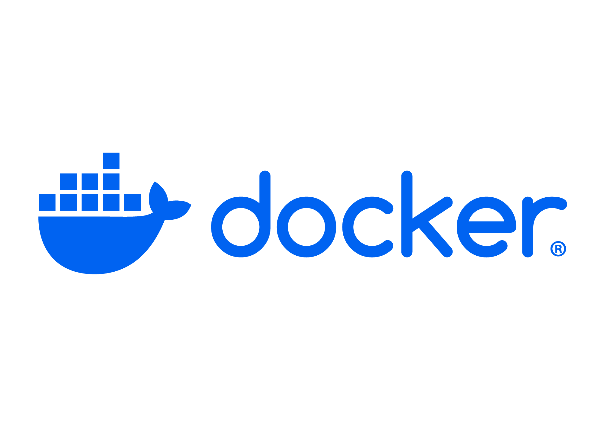
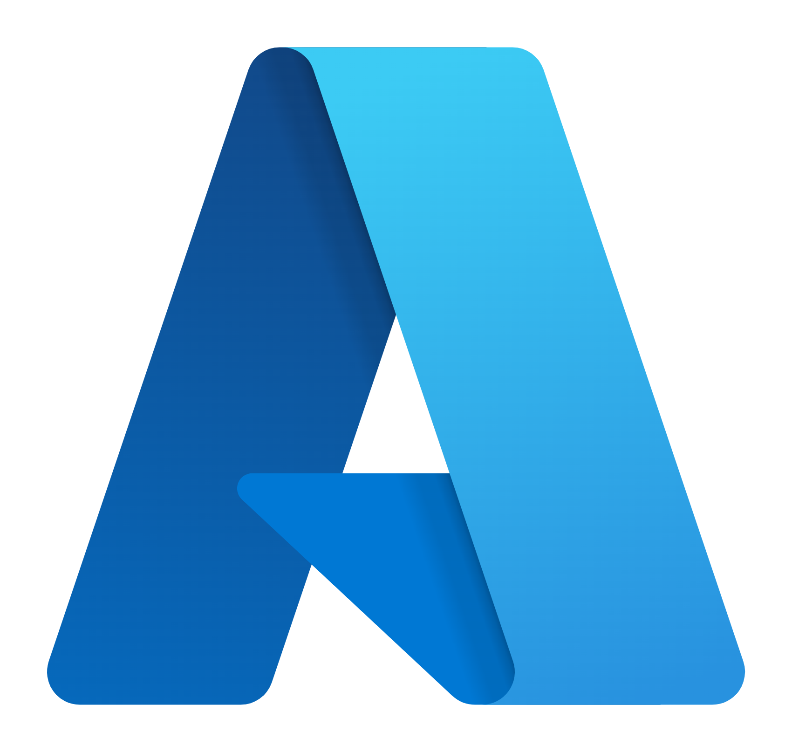
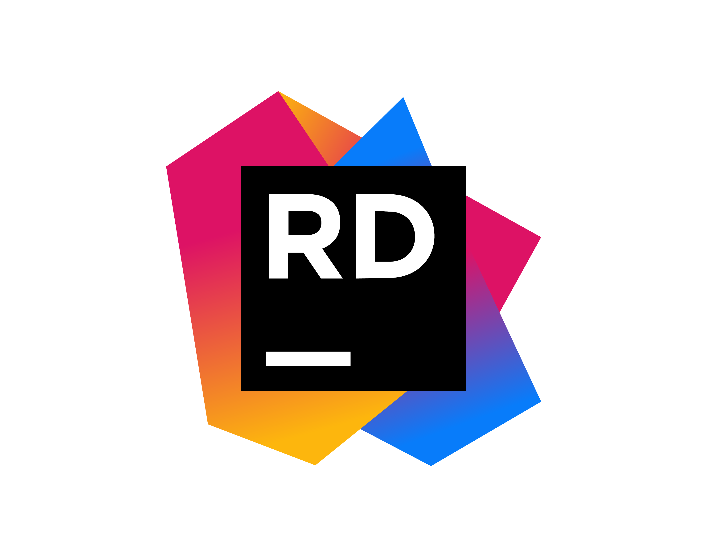

# Hello! 👋 I am Mornanté Basson #

 
     

Intermediate Software Developer aiming to become an Solutions Architect.

- With a versatile background that includes past experience as a solutions architect, I bring a unique perspective to software development.
- I thrive on the challenges of architecting and developing scalable, cloud-native applications that leverage Azure's robust capabilities.
- My passion for Azure extends beyond the code.
- I'm committed to staying at the forefront of Azure innovations, continuously improving my skills, and helping businesses maximize their potential in the cloud.

Having successfully designed and implemented solutions, I am now directing my focus towards cutting-edge technologies.

Let's connect to discuss technology trends, share insights, and explore potential collaborations. Feel free to reach out for meaningful tech discussions and networking opportunities!

    
    
    

 

# 🔌 Programming languages and Frameworks

    <table align="center">
        <tr>
            <td align="center">
                
                 HTML
            </td>
            <td align="center">
                
                 Angular
            </td>
            <td align="center">
                
                 React
            </td>
            <td align="center">
                
                 .NET MVC
            </td>
            <td align="center">
                
                 JavaScript
            </td>
            <td align="center">
                
                 TypeScript
            </td>
            <td align="center">
                
                 jQuery
            </td>
        </tr>
        <tr>
            <td align="center">
                
                 CSS
            </td>
            <td align="center">
                
                 SASS
            </td>
            <td align="center">
                
                 Python
            </td>
            <td align="center">
                
                 C#
            </td>
            <td align="center">
                
                 .NET Framework
            </td>
            <td align="center">
                
                 .NET Core
            </td>
        </tr>
    </table>

 

# 💻 Technologies

    <table align="center">
        <tr>
            <td align="center">
                
                 Git
            </td>
             <td align="center">
                
                 Github
            </td>
            <td align="center">
                
                 BitBucket
            </td>
            <td align="center">
                
                 TFS
            </td>
            <td align="center">
                
                 Redis
            </td>
            <td align="center">
                
                 EF Core
            </td>
            <td align="center">
                
                 MSSQL Server
            </td>
        </tr>
        <tr>
            <td align="center">
                
                 Mongo DB
            </td>
            <td align="center">
                
                 Redshift
            </td>
            <td align="center">
                
                 Docker
            </td>
        </tr>
    </table>

 

# ☁️ Cloud Platforms

    <table align="center" style="border: none !important;">
        <tr>
            <td align="center">
                
                 Azure
            </td>
            <td align="center">
                
                 AWS
            </td>
            <td align="center">
                
                 GCP
            </td>
        </tr>
    </table>

 

# 🔨 Development Tools

    <table align="center">
        <tr>
            <td align="center">
                
                 Visual Studio
            </td>
            <td align="center">
                
                 Visual Studio Code
            </td>
            <td align="center">
                
                 Rider
            </td>
        </tr>
    </table>

 

# Attributions for all the amazing icons, illustrations and media used on this README

    <table align="center">
        <tr>
            <td align="center">
                <a href="https://logowik.com/">Icons by LogoWik</a>
            </td>
            <td align="center">
                <a href="https://www.freepik.com/icon/github_5968866#fromView=keyword&page=1&position=4&uuid=877296c1-912a-4a19-b162-a0d7531d3cf2">Icon by Freepik</a>
            </td>
            <td align="center">
                <a href="https://www.freepik.com/icon/typescript_5968381#fromView=search&page=1&position=0&uuid=66277ef8-fb24-4d6f-bd00-2e27ded8a644">Icon by Freepik</a>
            </td>
            <td align="center">
                <a href="https://www.freepik.com/icon/js_5968292#fromView=search&page=1&position=0&uuid=bd862474-709b-4cef-9842-b3eff41f0600">Icon by Freepik</a>
            </td>
            <td align="center">
                <a href="https://www.freepik.com/icon/css-3_732190#fromView=search&page=1&position=1&uuid=77adbcb4-3646-48ed-bb1b-bfd4830b96a8">Icon by Pixel perfect</a>
            </td>
            <td align="center">
                <a href="https://www.freepik.com/icon/web_15474213#fromView=search&page=1&position=3&uuid=b963e756-376b-4112-8ba9-aa6dfa60c0f2">Icon by pocike</a>
            </td>
        </tr>
        <tr>
            <td align="center">
                <a href="https://www.freepik.com/icon/python_5968350#fromView=search&page=1&position=8&uuid=294596ae-aead-4e49-a073-1bf397f29839">Icon by Freepik</a>
            </td>
            <td align="center">
                <a href="https://www.freepik.com/icon/sass_5968358#fromView=search&page=1&position=12&uuid=24b2e946-c4b2-47a6-a919-d8818d626a52">Icon by Freepik</a>
            </td>
            <td align="center">
                <a href="https://www.freepik.com/icon/c-sharp_6132221#fromView=search&page=1&position=0&uuid=b39868d7-c888-48e7-8640-f601c016c60c">Icon by Freepik</a>
            </td>
            <td align="center">
                <a href="https://www.freepik.com/icon/windows_13170416#fromView=search&page=1&position=28&uuid=0d69b63c-acef-4e2b-8f72-ef6af7a51bd4">Icon by Vector Stall</a>
            </td>
        </tr>
    </table>

